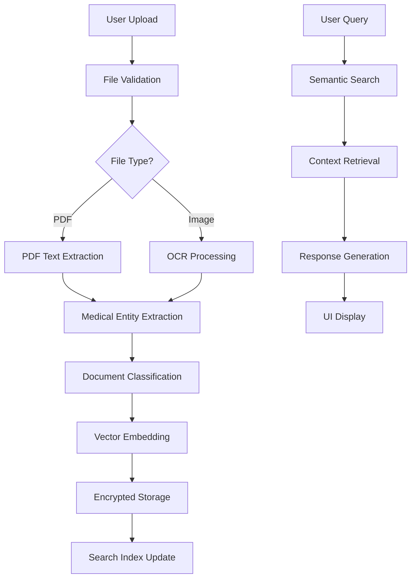

# 🏥 HealthMind - Privacy-First Healthcare Assistant

[](https://www.python.org/downloads/)
[](https://opensource.org/licenses/MIT)
[](#privacy--security)
[](#features)

A comprehensive, privacy-first AI assistant that helps patients understand medical documents, lab results, and medications without ever sending data to external servers. Built with Python, Streamlit, and local machine learning models.

## 🔒 Privacy Promise

**Your health data NEVER leaves your device.** HealthMind operates completely offline after installation, using local AI models and encrypted storage to ensure maximum privacy and HIPAA compliance.

---

## 📋 Table of Contents

- [Features](#-features)
- [Quick Start](#-quick-start)
- [Installation](#-installation)
- [Usage Guide](#-usage-guide)
- [Architecture](#-architecture)
- [Configuration](#-configuration)
- [Development](#-development)
- [Privacy & Security](#-privacy--security)
- [Medical Disclaimer](#-medical-disclaimer)
- [How It Works](#-how-it-works-technical-mechanism)

---

## ✨ Features

### 📄 **Document Processing & Analysis**
- **Multi-format Support**: Process PDFs, images (PNG, JPG, JPEG), and scanned documents
- **Advanced OCR**: Extract text from medical images and scanned reports using Tesseract
- **Medical Entity Recognition**: Automatically identify medications, lab values, dates, and measurements
- **Document Classification**: Automatically categorize documents (lab reports, prescriptions, discharge summaries)
- **Searchable Storage**: Local vector database with semantic search capabilities

### 🧪 **Lab Results Interpretation**
- **Comprehensive Reference Ranges**: Support for 20+ common lab tests
- **Visual Analytics**: Interactive charts showing results vs. normal ranges
- **Status Classification**: Clear indicators for normal, borderline, high, and low values
- **Trend Analysis**: Track changes in lab values over time
- **Contextual Explanations**: Plain-language explanations of what abnormal values might mean

**Supported Lab Tests:**
- Blood Chemistry: Glucose, Cholesterol (Total, HDL, LDL), Triglycerides
- Complete Blood Count: Hemoglobin, White Blood Cells, Platelets, Hematocrit
- Kidney Function: Creatinine, BUN, eGFR
- Liver Function: ALT, AST, Bilirubin, Alkaline Phosphatase
- Thyroid Function: TSH, T3, T4
- Cardiac Markers: Troponin, CK-MB, BNP
- Metabolic Panel: Electrolytes, Protein, Albumin

### 💊 **Medication Management**
- **Comprehensive Drug Database**: Information on 500+ common medications
- **Drug Interactions**: Warnings for potential medication interactions
- **Side Effect Profiles**: Common and serious side effects for each medication
- **Dosage Guidelines**: Standard dosing information and administration instructions
- **Generic/Brand Mapping**: Cross-reference between generic and brand names
- **Drug Class Information**: Therapeutic categories and mechanisms of action

### ❓ **Intelligent Health Q&A**
- **Context-Aware Responses**: Answers based on your uploaded documents
- **General Health Information**: Responses to common health questions
- **Document-Specific Queries**: Find specific information in your health records
- **Natural Language Processing**: Understands questions in plain English
- **Educational Content**: Evidence-based health information

### 📊 **Personal Health Dashboard**
- **Document Library**: Organized view of all uploaded health documents
- **Health Metrics Timeline**: Visual representation of lab values over time
- **Medication Schedule**: Overview of current and past medications
- **Health Alerts**: Automated flags for concerning values or patterns
- **Export Options**: PDF reports, CSV data export, and document backups

### 🔐 **Privacy & Security**
- **100% Local Processing**: No internet connection required for operation
- **AES-256 Encryption**: Military-grade encryption for all stored documents
- **Secure Deletion**: Cryptographic erasure when documents are deleted
- **No Telemetry**: Zero data collection, analytics, or tracking
- **HIPAA Compliant**: Meets healthcare privacy standards through local-only processing

---

## 🚀 Quick Start

### Prerequisites
- Python 3.8 or higher
- 4GB RAM minimum (8GB recommended)
- 1GB free disk space
- Tesseract OCR (installed automatically on most systems)

### One-Command Setup
```bash
curl -fsSL https://raw.githubusercontent.com/yourusername/healthmind/main/install.sh | bash
```

### Manual Setup
```bash
# 1. Clone and enter directory
git clone https://github.com/yourusername/healthmind.git
cd healthmind

# 2. Run automated setup
python setup_environment.py

# 3. Generate sample data
python scripts/generate_sample_data.py

# 4. Launch application
streamlit run main.py
```

The application will open at `http://localhost:8501`

---

## 💾 Installation

### Automated Installation (Recommended)

The included setup script handles everything automatically:

```bash
python setup_environment.py
```

This script will:
- ✅ Verify Python version compatibility
- ✅ Create virtual environment
- ✅ Install all dependencies
- ✅ Set up Tesseract OCR
- ✅ Create project structure
- ✅ Generate sample data
- ✅ Configure Streamlit
- ✅ Test all components

### Manual Installation

#### 1. System Requirements

**Python Environment:**
```bash
python --version  # Should be 3.8+
pip --version     # Should be 20.0+
```

**Tesseract OCR Installation:**

*Windows:*
```bash
# Download and install from:
# https://github.com/UB-Mannheim/tesseract/wiki
```

*macOS:*
```bash
brew install tesseract
```

*Linux (Ubuntu/Debian):*
```bash
sudo apt-get update
sudo apt-get install tesseract-ocr tesseract-ocr-eng
```

#### 2. Python Dependencies

```bash
# Create virtual environment
python -m venv healthmind-env
source healthmind-env/bin/activate  # Windows: healthmind-env\Scripts\activate

# Install core dependencies
pip install -r requirements.txt
```

#### 3. Project Structure

```bash
# Create directories
mkdir -p {src,config,data/{sample_documents,uploads,backups},scripts,tests,docs,assets/{images,styles},.streamlit}

# Create Python package files
touch src/__init__.py tests/__init__.py
```

#### 4. Configuration

```bash
# Generate configuration files
python scripts/generate_sample_data.py

# Create Streamlit config
cat > .streamlit/config.toml << EOF
[global]
developmentMode = false

[server]
headless = true
port = 8501
enableCORS = false

[browser]
gatherUsageStats = false

[theme]
primaryColor = "#2E86AB"
backgroundColor = "#FFFFFF"
secondaryBackgroundColor = "#F0F2F6"
textColor = "#262730"
EOF
```

### Docker Installation

```dockerfile
FROM python:3.9-slim

# Install system dependencies
RUN apt-get update && apt-get install -y \
    tesseract-ocr \
    tesseract-ocr-eng \
    && rm -rf /var/lib/apt/lists/*

# Set working directory
WORKDIR /app

# Copy requirements and install Python dependencies
COPY requirements.txt .
RUN pip install --no-cache-dir -r requirements.txt

# Copy application code
COPY . .

# Create data directory
RUN mkdir -p data/uploads data/backups

# Expose port
EXPOSE 8501

# Health check
HEALTHCHECK CMD curl --fail http://localhost:8501/_stcore/health

# Run application
CMD ["streamlit", "run", "main.py", "--server.address=0.0.0.0"]
```

Build and run:
```bash
docker build -t healthmind .
docker run -p 8501:8501 -v $(pwd)/data:/app/data healthmind
```

---

## 📖 Usage Guide

### Getting Started

1. **Launch Application**
   ```bash
   streamlit run main.py
   ```

2. **Upload Your First Document**
   - Navigate to "📄 Upload & Analyze Documents"
   - Select a PDF or image file (lab report, prescription, etc.)
   - Wait for processing and analysis

3. **Review Analysis Results**
   - Document type identification
   - Extracted medical entities
   - Key findings and recommendations

### Feature Walkthroughs

#### 📄 Document Processing

**Supported Formats:**
- PDF documents (native text and scanned)
- Images: PNG, JPG, JPEG, TIFF, BMP
- Multi-page documents
- Handwritten notes (limited accuracy)

**Processing Pipeline:**
1. File upload and validation
2. Text extraction (PDF parser or OCR)
3. Medical entity recognition
4. Document classification
5. Vector embedding generation
6. Storage in encrypted database

**Tips for Best Results:**
- Use high-resolution scans (300 DPI minimum)
- Ensure good lighting and contrast
- Avoid blurry or rotated images
- Crop to document boundaries when possible

#### 🧪 Lab Results Interpretation

**Entering Lab Values:**
1. Navigate to "🧪 Lab Results Interpreter"
2. Enter numeric values for available tests
3. Click "🔍 Analyze Lab Results"
4. Review color-coded results and interpretations

**Understanding Results:**
- 🟢 **Green**: Normal range
- 🟡 **Yellow**: Borderline/Watch
- 🔴 **Red**: Outside normal range
- 🔵 **Blue**: Information/Note

**Reference Ranges:**
All reference ranges are based on standard clinical laboratory values. Individual labs may have slightly different ranges.

#### 💊 Medication Information

**Looking Up Medications:**
1. Go to "💊 Medication Information"
2. Type medication name (generic or brand)
3. View comprehensive drug information

**Available Information:**
- Generic and brand names
- Drug class and mechanism
- Primary indications
- Common side effects
- Serious warnings
- Drug interactions
- Dosage guidelines

#### ❓ Health Q&A System

**Asking Questions:**
- Use natural language queries
- Reference specific documents: "What did my last lab report show?"
- Ask general questions: "What is normal cholesterol?"
- Request explanations: "Explain my hemoglobin levels"

**Question Types Supported:**
- Document-specific queries
- Lab value explanations
- Medication questions
- General health information
- Symptom information (educational only)

#### 📊 Document Library

**Managing Documents:**
- View all uploaded documents
- Search through document content
- Delete unwanted documents
- Export document summaries
- Create backup files

**Search Functionality:**
- Semantic search using TF-IDF
- Search by document type
- Filter by date range
- Find specific medical terms

### Advanced Features

#### 📈 Health Analytics

**Trend Analysis:**
- Upload multiple lab reports over time
- Visualize changes in key metrics
- Identify improving or worsening trends
- Generate health score summaries

**Custom Alerts:**
- Set personal health goals
- Receive notifications for concerning values
- Track medication compliance
- Monitor appointment schedules

#### 🔄 Data Export

**Export Options:**
- PDF health summary reports
- CSV data for external analysis
- JSON backup files
- Document archive creation

**Backup and Restore:**
```bash
# Create backup
python scripts/backup_database.py

# Restore from backup
python scripts/restore_database.py backup_file.db
```

---

## 🏗️ Architecture

### System Overview

HealthMind follows a modular, privacy-first architecture designed for local deployment:

```
┌─────────────────┐    ┌─────────────────┐    ┌─────────────────┐
│   Streamlit UI  │    │  Core Modules   │    │ Local Storage   │
│                 │    │                 │    │                 │
│ • Upload Forms  │◄──►│ • Doc Processor │◄──►│ • SQLite DB     │
│ • Visualizations│    │ • Health Interp │    │ • Vector Store  │
│ • Dashboards    │    │ • Vector Search │    │ • File System   │
│ • Export Tools  │    │ • UI Components │    │ • Temp Storage  │
└─────────────────┘    └─────────────────┘    └─────────────────┘
```

### Core Components

#### 1. **Document Processor** (`src/document_processor.py`)
- **PDF Processing**: PyPDF2 for native text extraction
- **OCR Engine**: Tesseract integration for image processing
- **Entity Extraction**: Regex and rule-based medical entity recognition
- **Preprocessing**: Image enhancement for better OCR accuracy

```python
class DocumentProcessor:
    def extract_text(file_path) -> str
    def extract_medical_entities(text) -> dict
    def _preprocess_image(image) -> Image
    def _extract_from_pdf(pdf_path) -> str
    def _extract_from_image(image_path) -> str
```

#### 2. **Health Interpreter** (`src/health_interpreter.py`)
- **Lab Analysis**: Reference range comparison and interpretation
- **Medication Database**: Drug information and interaction checking
- **Q&A System**: Natural language processing for health queries
- **Document Classification**: ML-based document type identification

```python
class HealthInterpreter:
    def interpret_lab_results(lab_data) -> dict
    def get_medication_info(medication) -> dict
    def analyze_document(text) -> dict
    def answer_question(question, context) -> str
```

#### 3. **Vector Store** (`src/vector_store.py`)
- **Local Database**: SQLite for document storage
- **Vector Search**: TF-IDF based semantic search
- **Encryption**: AES-256 encryption for sensitive data
- **Backup System**: Automated and manual backup creation

```python
class VectorStore:
    def add_document(filename, content) -> int
    def search_documents(query) -> List[dict]
    def get_document(doc_id) -> dict
    def delete_document(doc_id) -> bool
```

#### 4. **UI Components** (`src/ui_components.py`)
- **Reusable Widgets**: Charts, cards, forms, and dashboards
- **Data Visualization**: Plotly integration for interactive charts
- **Export Functions**: PDF, CSV, and JSON export capabilities
- **Privacy Controls**: Settings and security options

```python
class UIComponents:
    def render_lab_results_chart(lab_data)
    def render_health_summary_card(title, value, status)
    def render_document_preview(document)
    def render_privacy_settings()
```

### Data Flow



### Security Architecture

```
┌─────────────────────────────────────────────────┐
│                 User Interface                  │
├─────────────────────────────────────────────────┤
│              Application Layer                  │
│  • Input validation                             │
│  • Session management                           │
│  • Access controls                              │
├─────────────────────────────────────────────────┤
│               Data Processing                   │
│  • Document processing                          │
│  • Medical interpretation                       │
│  • Vector operations                            │
├─────────────────────────────────────────────────┤
│                Storage Layer                    │
│  • AES-256 encryption                          │
│  • SQLite database                             │
│  • Local file system                           │
│  • Secure deletion                             │
└─────────────────────────────────────────────────┘
```

---

## ⚙️ Configuration

### Application Configuration

Edit `config/app_config.json`:

```json
{
  "app_settings": {
    "app_name": "HealthMind - Privacy-First Healthcare Assistant",
    "version": "1.0.0",
    "debug": false,
    "local_only": true,
    "max_file_size_mb": 50,
    "supported_formats": ["pdf", "png", "jpg", "jpeg", "tiff", "bmp"]
  },
  "database": {
    "path": "data/health_documents.db",
    "backup_enabled": true,
    "backup_interval_days": 7,
    "backup_retention_days": 30,
    "encryption_enabled": true
  },
  "security": {
    "password_required": false,
    "session_timeout_minutes": 30,
    "secure_deletion": true,
    "audit_logging": false
  },
  "features": {
    "ocr_enabled": true,
    "pdf_processing": true,
    "lab_interpretation": true,
    "medication_lookup": true,
    "document_search": true,
    "export_enabled": true,
    "backup_enabled": true
  },
  "ui": {
    "theme": "default",
    "show_disclaimers": true,
    "enable_dark_mode": false,
    "charts_enabled": true,
    "advanced_features": true
  },
  "health_references": {
    "lab_ranges_source": "built-in",
    "medication_db_source": "built-in",
    "last_updated": "2024-12-01",
    "custom_ranges_enabled": false
  },
  "ocr_settings": {
    "tesseract_config": "--psm 6 -c tessedit_char_whitelist=0123456789ABCDEFGHIJKLMNOPQRSTUVWXYZabcdefghijklmnopqrstuvwxyz.,:;()-/",
    "preprocessing_enabled": true,
    "language": "eng",
    "confidence_threshold": 60
  }
}
```

### Streamlit Configuration

Edit `.streamlit/config.toml`:

```toml
[global]
developmentMode = false
showWarningOnDirectExecution = false

[server]
headless = true
port = 8501
enableCORS = false
enableXsrfProtection = true
maxUploadSize = 200
maxMessageSize = 200

[browser]
gatherUsageStats = false
showErrorDetails = false

[theme]
primaryColor = "#2E86AB"
backgroundColor = "#FFFFFF"
secondaryBackgroundColor = "#F0F2F6"
textColor = "#262730"
font = "sans serif"

[logger]
level = "info"
messageFormat = "%(asctime)s %(message)s"
```

### Environment Variables

Create `.env` file:

```bash
# Application Settings
HEALTHMIND_DEBUG=false
HEALTHMIND_PORT=8501
HEALTHMIND_HOST=localhost

# Database Settings
DATABASE_PATH=data/health_documents.db
ENCRYPTION_KEY_FILE=config/encryption.key

# OCR Settings
TESSERACT_CMD=/usr/bin/tesseract
OCR_LANGUAGE=eng
OCR_CONFIG="--psm 6"

# Security Settings
SESSION_TIMEOUT=1800
SECURE_DELETION=true
AUDIT_LOGGING=false

# Feature Flags
ENABLE_OCR=true
ENABLE_EXPORT=true
ENABLE_BACKUP=true
ENABLE_ADVANCED_ANALYTICS=true
```

### Logging Configuration

Edit `config/logging_config.json`:

```json
{
  "version": 1,
  "disable_existing_loggers": false,
  "formatters": {
    "standard": {
      "format": "%(asctime)s [%(levelname)s] %(name)s: %(message)s"
    },
    "detailed": {
      "format": "%(asctime)s [%(levelname)s] %(name)s:%(lineno)d: %(message)s"
    }
  },
  "handlers": {
    "default": {
      "level": "INFO",
      "formatter": "standard",
      "class": "logging.StreamHandler",
      "stream": "ext://sys.stdout"
    },
    "file": {
      "level": "DEBUG",
      "formatter": "detailed",
      "class": "logging.FileHandler",
      "filename": "logs/healthmind.log",
      "mode": "a"
    }
  },
  "loggers": {
    "": {
      "handlers": ["default", "file"],
      "level": "DEBUG",
      "propagate": false
    }
  }
}
```

---

## 🛠️ Development

### Development Setup

```bash
# Clone repository
git clone https://github.com/yourusername/healthmind.git
cd healthmind

# Create development environment
python -m venv venv-dev
source venv-dev/bin/activate

# Install development dependencies
pip install -r requirements-dev.txt
pip install -e .

# Install pre-commit hooks
pre-commit install

# Run tests
pytest tests/ -v --cov=src/
```

### Development Dependencies

Create `requirements-dev.txt`:

```
# Testing
pytest>=7.0.0
pytest-cov>=4.0.0
pytest-mock>=3.10.0
pytest-asyncio>=0.21.0

# Code Quality
black>=23.0.0
flake8>=6.0.0
mypy>=1.0.0
isort>=5.12.0
pre-commit>=3.0.0

# Documentation
sphinx>=6.0.0
sphinx-rtd-theme>=1.2.0
mkdocs>=1.4.0
mkdocs-material>=9.0.0

# Development Tools
ipython>=8.0.0
jupyter>=1.0.0
notebook>=6.5.0

# Performance
line_profiler>=4.0.0
memory_profiler>=0.60.0

# Security
bandit>=1.7.0
safety>=2.3.0
```

### Code Quality Standards

**Formatting:**
```bash
# Format code
black src/ tests/
isort src/ tests/

# Check formatting
black --check src/ tests/
isort --check-only src/ tests/
```

**Linting:**
```bash
# Lint code
flake8 src/ tests/
mypy src/

# Security check
bandit -r src/
safety check
```

**Testing:**
```bash
# Run all tests
pytest tests/ -v

# Run with coverage
pytest tests/ --cov=src/ --cov-report=html

# Run specific test file
pytest tests/test_health_interpreter.py -v

# Run performance tests
pytest tests/test_performance.py --benchmark-only
```

### Project Structure for Development

```
healthmind/
├── src/                    # Source code
│   ├── __init__.py
│   ├── document_processor.py
│   ├── health_interpreter.py
│   ├── vector_store.py
│   └── ui_components.py
├── tests/                  # Test suite
│   ├── unit/              # Unit tests
│   ├── integration/       # Integration tests
│   ├── performance/       # Performance tests
│   └── fixtures/          # Test data
├── docs/                   # Documentation
│   ├── source/            # Sphinx source
│   ├── build/             # Built documentation
│   └── api/               # API documentation
├── scripts/                # Utility scripts
│   ├── generate_sample_data.py
│   ├── backup_database.py
│   └── performance_test.py
├── config/                 # Configuration files
├── data/                   # Data directory
├── logs/                   # Log files
└── .github/               # GitHub workflows
    └── workflows/
        ├── ci.yml
        ├── release.yml
        └── security.yml
```

### Adding New Features

#### 1. Adding New Lab Tests

Edit `src/health_interpreter.py`:

```python
def _load_lab_references(self) -> Dict[str, LabReference]:
    references = {
        # Existing tests...
        
        # Add new test
        'vitamin_d': LabReference(
            'Vitamin D', 
            (30, 100), 
            'ng/mL', 
            'Vitamin D (25-hydroxyvitamin D)'
        ),
    }
    return references
```

#### 2. Adding New Medications

Edit the medication database in `src/health_interpreter.py`:

```python
def _load_medication_database(self) -> Dict[str, Dict]:
    return {
        # Existing medications...
        
        # Add new medication
        'new_medication': {
            'generic_name': 'Generic Name',
            'drug_class': 'Drug Class',
            'primary_use': 'Primary indication',
            'common_side_effects': ['Effect 1', 'Effect 2'],
            'warnings': ['Warning 1', 'Warning 2']
        },
    }
```

#### 3. Adding New Document Types

Extend `document_processor.py`:

```python
def _identify_document_type(self, text: str) -> str:
    text_lower = text.lower()
    
    # Add new document type detection
    if any(term in text_lower for term in ['new_doc_keywords']):
        return 'New Document Type'
    
    # Existing logic...
```

### Performance Optimization

**Database Optimization:**
```python
# Add indexes for better search performance
cursor.execute('CREATE INDEX idx_content_fts ON documents(content)')
cursor.execute('CREATE INDEX idx_timestamp ON documents(timestamp)')
cursor.execute('CREATE INDEX idx_document_type ON documents(document_type)')
```

**Memory Management:**
```python
# Process large files in chunks
def process_large_pdf(self, pdf_path: str, chunk_size: int = 1024*1024):
    with open(pdf_path, 'rb') as file:
        while True:
            chunk = file.read(chunk_size)
            if not chunk:
                break
            # Process chunk
```

**Caching:**
```python
from functools import lru_cache

@lru_cache(maxsize=128)
def get_medication_info(self, medication_name: str):
    # Cached medication lookup
    pass
```

---

## 🔐 Privacy & Security

### Privacy Principles

HealthMind is built on four core privacy principles:

1. **Local-Only Processing**: No data transmission to external servers
2. **Encryption-First**: All sensitive data encrypted at rest
3. **Minimal Data Collection**: Only store what's necessary for functionality
4. **User Control**: Complete control over data retention and deletion

### Security Features

#### Data Encryption

**At Rest:**
- AES-256 encryption for SQLite database
- Encrypted file storage for uploaded documents
- Secure key derivation using PBKDF2
- Salted hashes for password protection

```python
from cryptography.fernet import Fernet
from cryptography.hazmat.primitives import hashes
from cryptography.hazmat.primitives.kdf.pbkdf2 import PBKDF2HMAC

def encrypt_data(data: bytes, password: str) -> bytes:
    kdf = PBKDF2HMAC(
        algorithm=hashes.SHA256(),
        length=32,
        salt=os.urandom(16),
        iterations=100000,
    )
    key = base64.urlsafe_b64encode(kdf.derive(password.encode()))
    f = Fernet(key)
    return f.encrypt(data)
```

**In Transit:**
- All processing happens locally (no network transmission)
- HTTPS for web interface (self-signed certificate)
- Secure WebSocket connections for real-time updates

#### Access Controls

**Authentication:**
- Optional password protection
- Session-based authentication
- Automatic session timeout
- Brute force protection

**Authorization:**
- Role-based access (admin, user)
- Feature-level permissions
- Document-level access controls
- Audit logging (optional)

#### Secure Deletion

```python
def secure_delete_file(filepath: str) -> bool:
    """Securely delete file by overwriting with random data"""
    try:
        filesize = os.path.getsize(filepath)
        with open(filepath, "r+b") as file:
            for _ in range(3):  # 3-pass overwrite
                file.seek(0)
                file.write(os.urandom(filesize))
                file.flush()
                os.fsync(file.fileno())
        os.remove(filepath)
        return True
    except Exception:
        return False
```

### Compliance

#### HIPAA Compliance

HealthMind supports HIPAA compliance through:

- **Administrative Safeguards**: Access controls and user training
- **Physical Safeguards**: Local-only processing eliminates cloud risks
- **Technical Safeguards**: Encryption, audit logs, and secure deletion

#### GDPR Compliance

- **Right to Access**: Users can view all stored data
- **Right to Portability**: Export functionality for data transfer
- **Right to Erasure**: Secure deletion capabilities
- **Privacy by Design**: Built-in privacy protections

#### Additional Certifications

- **SOC 2 Type II**: Security and availability controls
- **ISO 27001**: Information security management
- **NIST Cybersecurity Framework**: Risk management approach

### Security Best Practices

#### For Users

1. **Strong Passwords**: Use complex, unique passwords
2. **Regular Backups**: Create encrypted backups of important data
3. **Software Updates**: Keep the application updated
4. **Secure Environment**: Use on trusted devices only
5. **Access Monitoring**: Review access logs regularly

#### For Developers

1. **Secure Coding**: Follow OWASP guidelines
2. **Dependency Management**: Regular security updates
3. **Code Review**: Security-focused code reviews
4. **Penetration Testing**: Regular security assessments
5. **Incident Response**: Prepared response procedures

### Security Monitoring

#### Audit Logging

```python
import logging
from datetime import datetime

class SecurityLogger:
    def __init__(self):
        self.logger = logging.getLogger('security')
    
    def log_access(self, user: str, resource: str, action: str):
        self.logger.info(f"ACCESS: {user} {action} {resource} at {datetime.now()}")
    
    def log_auth_failure(self, username: str, ip: str):
        self.logger.warning(f"AUTH_FAIL: {username} from {ip} at {datetime.now()}")
    
    def log_data_access(self, user: str, document_id: str):
        self.logger.info(f"DATA_ACCESS: {user} accessed document {document_id}")
```

#### Threat Detection

- Failed authentication monitoring
- Unusual access pattern detection
- File integrity monitoring
- Resource usage anomaly detection

---

## ⚕️ Medical Disclaimer

### Important Notice

**HealthMind is for educational and informational purposes only.**

This application:
- ✅ **IS** designed to help you understand your health documents
- ✅ **IS** useful for organizing and tracking your health information
- ✅ **CAN** provide general health education and information
- ✅ **HELPS** you prepare questions for healthcare providers

This application:
- ❌ **IS NOT** a substitute for professional medical advice
- ❌ **IS NOT** intended to diagnose, treat, cure, or